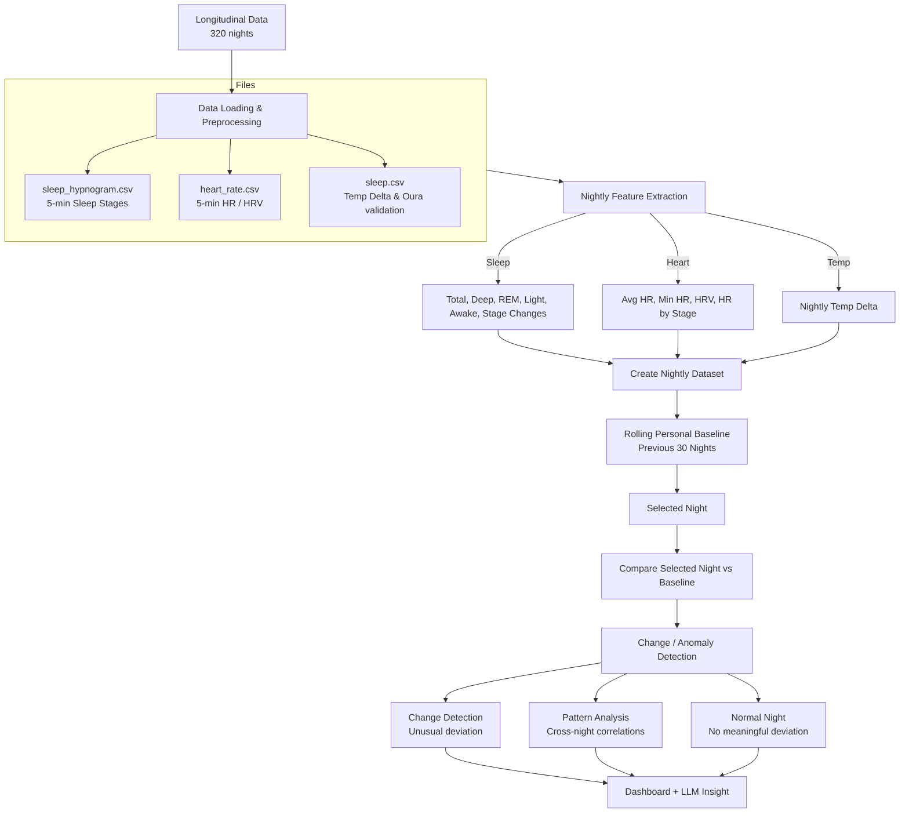

# Wearable-Health-Detective-Sleep-Quality-Analysis

Team 7
Team members: Sathwika Thatiparthi, Hai Nguyen, Nitin Thota, Abhiram Gunna, Youngjun Ryoo, Joshua Feng

# Importance of the Topic

Sleep is an important health metric because poor or irregular sleep can affect a person's overall health, daily performance, and well-being. Wearable devices can collect large amounts of sleep-related data, but users may have difficulty understanding what the data means or recognizing changes in their sleep patterns.

Our project aims to analyze wearable sleep data to identify important patterns such as sleep duration, sleep stages, awakenings, and changes in sleep quality. By combining sleep information with other measurements such as heart rate and skin temperature, the system can identify relationships between different health metrics.

The goal is not just to display sleep data, but to act as a "Sleep Detective" that helps users understand what changed, when it changed, and possible factors associated with the change. This directly addresses the data-overload problem discussed in the course slides, where wearable devices generate thousands of data points but users may not understand why their health metrics changed.
The project will primarily analyze three modalities:
Sleep
Heart Rate
Skin Temperature

# Project Goals

Our project has three main goals:
Analyze sleep quality and sleep patterns
Use the existing sleep-stage labels in the DREAMT dataset.
Calculate metrics such as total sleep time, time spent in each sleep stage, and number of awakenings.
Analyze relationships between sleep, heart rate, and skin temperature
Compare sleep-related metrics with heart rate and skin temperature.
Identify correlations and patterns without claiming direct causation.
Present sleep trends and insights to the user
Display results through graphs, timelines, and dashboards.
Provide simple, user-friendly explanations of important sleep changes.

# Pipeline

1. Data Input
   Load sleep-stage, heart-rate, skin-temperature, and timestamp data.
2. Data Preprocessing
   Clean and organize the dataset.
   Handle missing values.
   Align the different signals by time.
3. Sleep Analysis
   Calculate:
   Total sleep time
   Time in each sleep stage
   Deep sleep duration
   REM sleep duration
   Wake periods
   Number of awakenings
4. Heart Rate Analysis
   Calculate sleeping heart-rate statistics.
   Analyze heart-rate changes during different sleep stages.
5. Skin Temperature Analysis
   Analyze nighttime skin-temperature trends.
   Compare temperature across different sleep stages.
6. Multi-Modal Analysis
   Compare sleep metrics with heart-rate and skin-temperature measurements.
   Identify statistical relationships and useful patterns.
7. Pattern / Change Detection
   Detect unusual or meaningful sleep changes.
   Use statistical and rule-based methods to identify changes from normal patterns.
8. Visualization
   Display results using graphs, timelines, and dashboards.
9. User Insights
   Provide simple explanations of detected sleep patterns and changes.
   Optional AI-generated summaries may be added if time allows.

# Project Flow



## Timestamp alignment and exported fields

Run `python3 explore_data.py` to regenerate `aligned_data/par_*_aligned.csv`.
These are CSV files that can be opened in Excel. Each file contains one
participant, so neither `participant_id` nor the raw Unix timestamp is exported.
The raw timestamps measure milliseconds since the Unix epoch, not the sampling
interval. Signals are sampled at approximately five-minute intervals.

`datetime_utc`, `sleep_start_utc`, and `sleep_end_utc` use
`YYYY-MM-DD HH:MM:SS`. All three remain in UTC; the previous `+00:00` suffix
meant a zero offset from UTC. No participant local timezone is assumed.
`date` retains the source sleep record's night date. Alignment uses timezone-aware
timestamps internally and an exact outer join within each source sleep window;
unmatched measurements remain blank rather than being interpolated.

The README's proposal goals map to these exported inputs:

| Proposal measurement | Exported fields |
| --- | --- |
| Sleep stages and wake periods | `hypnogram_level`, `hypnogram_class`, `datetime_utc` |
| Total sleep, deep, REM, light, and awake duration | `night_total_sleep_seconds`, `night_deep_sleep_seconds`, `night_rem_sleep_seconds`, `night_light_sleep_seconds`, `night_awake_seconds` |
| Time in bed and sleep efficiency | `night_time_in_bed_seconds`, `night_sleep_efficiency_percent` |
| Awakenings and stage changes | `night_observed_awakenings`, `night_observed_stage_changes` |
| Heart rate and HRV by stage | `heart_rate`, `heart_rmssd` alongside the sleep-stage labels |
| Nightly heart-rate and HRV summaries | `night_hr_average`, `night_hr_lowest`, `night_hrv_rmssd` |
| Nightly temperature deviation | `temperature_delta` from `sleep.csv` |

Nightly values repeat on every signal row belonging to that sleep record. Do not
sum these repeated values or treat them as independent observations; reduce to
one record per sleep window for nightly trends and cross-night correlations.
Duration summaries are copied from Oura rather than estimated by counting labels.
Observed awakenings count sleep-to-awake transitions between consecutive
five-minute labels. Stage changes count any change between consecutive valid
labels. Neither count bridges gaps, and a night beginning awake does not count
as an awakening. These are coarse observed counts, not clinical arousal counts.
### Awakening Detection Rule

An awakening is defined as a transition from a valid sleep stage
(`light`, `deep`, or `rem`) to `awake` between consecutive 5-minute
sleep-stage samples.

- Consecutive `awake` labels are treated as one awakening.
- A single 5-minute awake period is retained as a short wake period.
- Missing or invalid sleep-stage labels are treated as unknown.
- Transitions are not counted across timestamp gaps greater than 5 minutes.
- If a sleep window begins in the `awake` state, that period contributes to
  total awake time but does not count as an awakening.
- Total awake time is calculated as the number of `awake` epochs × 5 minutes.

The available files contain a nightly temperature deviation, not absolute skin
temperature or a temperature time series. Repeating this nightly measurement
does not provide within-night or stage-specific temperature trends; those proposal
goals require additional data. Missing source temperatures remain blank.
The README also mentions DREAMT, but this script processes the local IFH Affect
Oura files. Baselines, correlations, anomaly detection, and dashboards are later
analysis steps, not outputs of timestamp alignment.

### Nightly feature extraction

Run the feature pipeline from the project root after generating or updating the
aligned CSVs:

```bash
python3 explore_data.py
python3 nightly_sleep_features.py
```

The second command writes `nightly_sleep_features.csv` in the project root, with
one row per participant sleep window. To use another input or output location,
pass `--aligned-dir` and `--output`:

```bash
python3 nightly_sleep_features.py \
  --aligned-dir aligned_data \
  --output output/nightly_sleep_features.csv
```

The table includes `participant_id`, `sleep_date`, and UTC sleep-window start
and end timestamps. `total_sleep_time_min`, `deep_sleep_min`, `rem_sleep_min`,
`light_sleep_min`, and `awake_min` come from the Oura nightly summary fields,
converted from seconds to minutes. `observed_awakenings_count` and
`observed_stage_changes_count` are the aligned Oura transition counts described
above. The script collapses repeated row-level summaries to one sleep-window
record and stops with an error if a summary value conflicts within that window.
Duration columns use minutes; count columns use counts. Missing source values
remain blank in the CSV.
